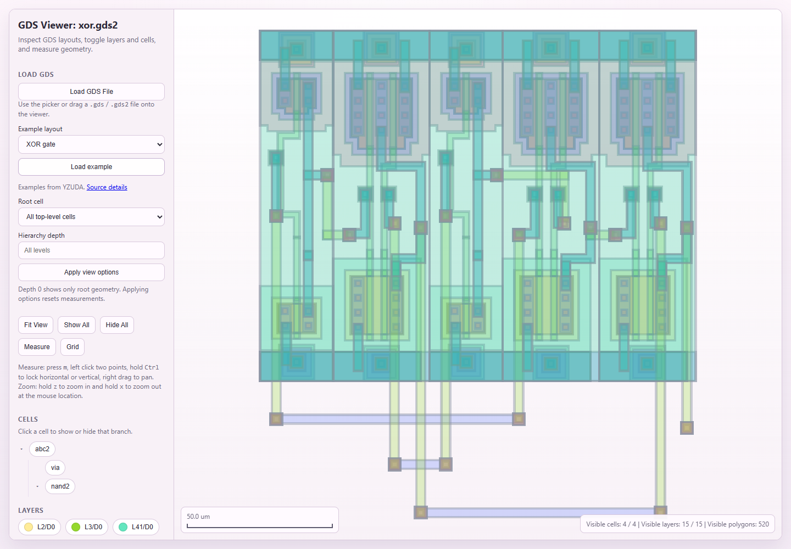

# GDS Viewer

A standalone GDSII viewer built with plain JavaScript and vendored PixiJS. Files are
parsed and rendered in your browser. No Python, uv, Node.js, backend API, or internet
connection is required by the viewer.



## Try the examples

Open `index.html`, choose an **Example layout**, and select **Load example**.
The bundled [YZUDA GDSII examples](https://www.yzuda.org/download/_GDSII_examples.html)
include an inverter, NAND gate, XOR gate, and a random layout with 1,000 polygons.
They load locally with no download or server needed. The screenshot above shows
`xor.gds2` with all layers visible; text labels are not rendered.
Original files, attribution, checksums, and the offline payload regeneration command
are in [examples/yzuda](examples/yzuda/README.md).

## Open a layout

Open `index.html` in a modern browser, then choose **Load GDS File** or drop a `.gds`
or `.gds2` file onto the viewer. Keep `gds_parser.js`, `gds_viewer.js`, and the `vendor` and `examples` folders
beside the HTML file. You can also serve this folder from any static web host,
including under a subdirectory. There is no install or build step.

`open_gds_viewer.bat` on Windows and `./open_gds_viewer.sh` on macOS/Linux open the
page with the default browser. They do not start a server and accept no arguments.
Direct `file://` loading of the bundled XOR example was tested in headless Microsoft
Edge on Windows. Native file-picker dialogs and macOS/Linux launchers were not
tested for this update; see [demo validation](docs/yzuda-demo-validation.md).

After loading a file:

- **Root cell:** show all design roots, or select one cell from the library.
- **Hierarchy depth:** leave blank for all levels; 0 includes root geometry only.
  Select **Apply view options** to rebuild the view. This resets measurements and visibility.
- Toggle individual layers or cell branches, or use **Show All** / **Hide All**.
- Drag to pan, use the wheel or hold **z** / **x** to zoom, and select **Fit View** to reset.
- Select **Measure** or press **m**, then click two points. Hold **Ctrl** to constrain
  the ruler horizontally or vertically. Right-drag pans while measuring. Select a
  ruler and press **Delete**, or use its delete button.
- Toggle **Grid** as needed. The scale bar and pointer readout follow the viewport.

Selected files stay local; the viewer has no upload or document-storage endpoint.
A failed parse leaves the previous layout available. Only the current parsed library
is retained, and replaced graphics contexts are destroyed. Files and geometry are
still buffered in browser memory, without file-size, polygon-count, time, or memory
limits. Large hierarchies can pause the browser or exhaust memory. Depth limits help
with traversal but do not provide a complete resource bound.

## Geometry support

Regression fixtures cover polygons, straight paths with flush, square, and explicit
end extensions, nested references, rectangular reference arrays, rotation,
magnification, reflection, layer/datatype separation, multiple roots, and depth limits.
Empty cells display an empty view; libraries without cells and malformed record
framing produce errors. Round-ended paths fail explicitly.
Zero padding after an ENDLIB record is accepted; nonzero trailing data is rejected.

This is not a complete GDSII implementation. Text, boxes, nodes, properties, uncommon
reference flags, vendor extensions, and arbitrary path joins are not guaranteed to
render correctly. Some unsupported element types are skipped. Coordinates in the
view model retain the previous viewer's rounding to 0.001 library user units.

## Distribution

The application consists of `index.html`, `gds_parser.js`, `gds_viewer.js`, and
`vendor/pixi.min.js`, plus `examples/yzuda/demo-data.js` for the offline demos.
Include the `vendor` notices, `examples/yzuda/README.md` attribution, and `LICENSE` when distributing it;
the launchers and README are optional conveniences. No generated Python package is
needed. PixiJS version, checksum, source, and update instructions are recorded in
[vendor/VENDORED.md](vendor/VENDORED.md).

The former Python API, CLI preloading, and all `/api/*` endpoints have been retired.
Use the file picker and browser view options in their place. See the
[migration record](docs/javascript-migration.md) for compatibility and validation details.

## Develop and validate

Node.js is needed only for development checks (validated with Node 24.14.1). No npm
packages or installation step are needed.

```text
node --check gds_parser.js
node --check gds_viewer.js
node --check tests/browser-smoke.js
node --test tests/*.test.cjs
```

The Node suite checks saved independent reference models, malformed inputs, and
static asset delivery. Fixture provenance is in [tests/fixtures/README.md](tests/fixtures/README.md).

For real-browser integration checks, run the optional local static test server:

```text
node tests/serve.cjs
```

Open the printed **Browser checks** URL and select **Run browser checks**. The harness
uses synthetic fixtures and the real Pixi renderer to exercise loading, view options,
visibility, navigation, measurements, resize, errors, overlapping loads, and graphics
cleanup. The helper binds only to loopback on an available port and exposes a fixed
list of application/test assets. It is a development convenience, not a viewer dependency.
Stop it with Ctrl+C. Also inspect the viewer visually and exercise a native file picker.

## License

Viewer code: MIT. See `LICENSE` and the vendored asset notices. Third-party demo
layouts have separate [source attribution](examples/yzuda/README.md); no explicit
license is stated on their download page.
