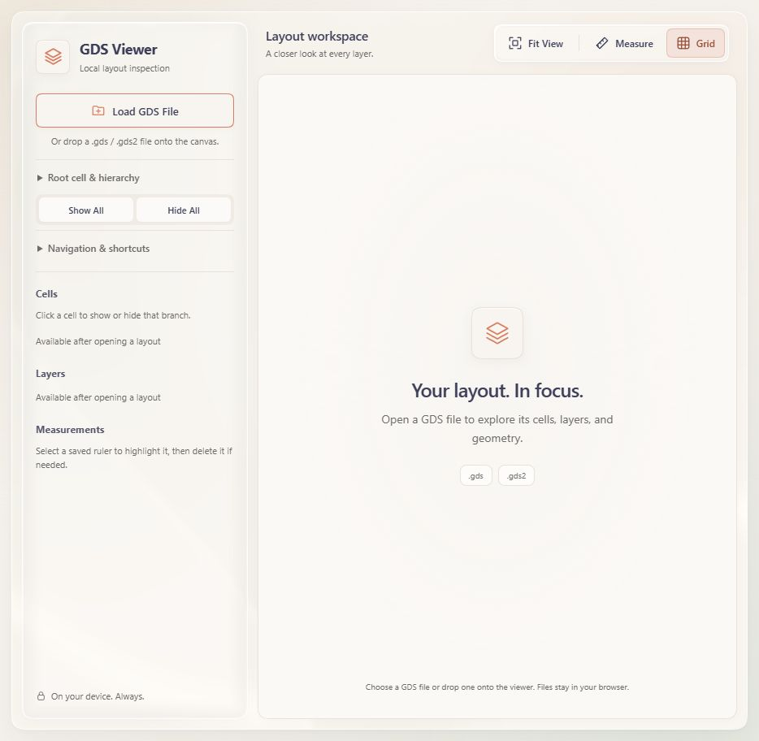

# Visual design review

The interface uses warm ivory surfaces, slate typography, sage indicators, and
terracotta accents. The palette follows the supplied Crystal Viewer reference.
Its purpose is to frame the geometry clearly while keeping controls easy to find.

## Review and changes

- **Visual hierarchy:** bright pane rims and overlapping shadows competed with
  the drawing. Softer edge lighting, quieter refraction, and lighter shadows now
  distinguish the sidebar and toolbar without dominating the canvas.
- **Color balance:** the Load button and logo tiles use cream surfaces. Their
  icon strokes and the Load button border use the reference's exact terracotta.
  Selected controls use a pale tint and darker text for readability.
- **Typography:** larger filenames, cell/layer labels, and supporting copy improve
  scanning. A smaller empty-state icon and more restrained heading size keep the
  primary action in the sidebar prominent.

| Role | Color |
| --- | --- |
| Canvas | Ivory `#FBF9F6` |
| Logo and Load button surfaces | Cream `#F8F5F1` |
| Main text | Slate `#3D405B` |
| Secondary text | Warm gray `#6D6A6A` |
| Borders | Pale stone `#EAE2D8` |
| Logo strokes and action accents | Terracotta `#E07A5F` |
| Grid | Sage `#8D9B87` |
| Small selected-control text | Deep terracotta `#984831` |

Geometry retains distinct layer/datatype colors. Rulers and pointer overlays use
terracotta shades, while the major/minor grid remains subdued. Squircle corners,
local liquid-glass rendering, reduced-motion behavior, and CSS fallback remain.

## Current captures

Captured on 8 September 2026 in the Codex in-app browser on Windows, using the
loopback server under `/viewer/`. The saved captures are 934 × 912 pixels.
The loaded view uses the unchanged public [YZUDA XOR file](../examples/yzuda/README.md):
4 cells, 15 layers, and 520 polygons. The file was opened through the browser's
normal file input; no private layout was used. The browser supplied JPEG captures;
they are stored as PNG with identical decoded pixels, without retouching or
resampling. Source and image hashes are recorded in the
[current capture manifest](images/current-capture-manifest.json).

The numbered walkthrough images and their crops retain the earlier styling and
their original provenance. Their controls and workflow still apply.

## Validation

Syntax checks and all 26 Node tests passed using the documented
`--test-isolation=none` fallback. All 17 browser checks passed, including loading,
visibility, navigation, measurements, grids, resize, reload cleanup, and glass
fallback. The empty and loaded views were visually inspected; grid toggling and
ruler readability were also checked manually.

Direct-file navigation and native OS picker dialogs were not revalidated. Other
browser engines and macOS/Linux launchers were not tested. Measurement-unit and
resource-limit caveats in the [README](../README.md) still apply.
