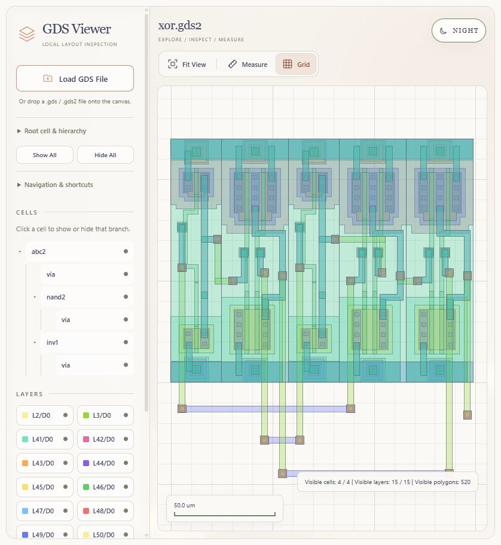
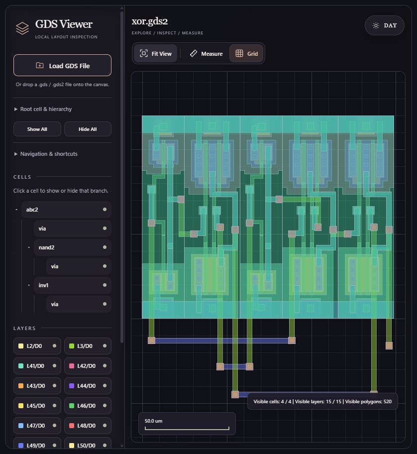

# Reproduce the day and night illustrations

The YZUDA layouts are documentation examples. The viewer opens your own files
through its normal picker or drag-and-drop controls.

1. Open `index.html` in a browser.
2. Select **Load GDS File** and choose `examples/yzuda/xor.gds2` from this repository.
3. The default view includes **All top-level cells** and every hierarchy level.
   If needed, expand **Root cell & hierarchy**, select that root option, clear
   **Hierarchy depth**, and click **Apply view options**.
4. Select **Show All** in the sidebar, then **Fit View** above the canvas.
5. Leave **Grid** enabled to show the major lines and five minor subdivisions.
6. Use **Day / Night** at the top right to capture both appearances. The button
   names the destination mode; changing it preserves the current layout and view.

| Day mode | Night mode |
| --- | --- |
|  |  |

The overview shows **4 / 4 cells**, **15 / 15 layers**, and **520 polygons** in
both modes. Click either image to inspect the full capture.

Toggle a layer chip to inspect overlapping geometry, drag to pan, or scroll to zoom.
Select **Measure**, then click two points to place a ruler. Measurement mode ends
after the second click; press **m** to cancel an unfinished ruler. **Fit View**
returns to the full layout. For the full walkthrough, open the
[guide in pictures](user-guide.md).

For other illustrations, load `inv.gds2`, `nand2.gds2`, or `1Kpolyg.gds` from the same
folder. The files are unchanged downloads from [YZUDA](https://www.yzuda.org/download/_GDSII_examples.html);
see [attribution and checksums](../examples/yzuda/README.md). The gate files contain
text elements the viewer does not render. These illustrations are not proof of
complete GDSII compatibility.
