# GDS Viewer: a guide in pictures

Each step shows the current interface in **day** and **night** modes. Day uses
ivory, sage, and terracotta; night uses charcoal and warm white. The pictures show
the same layout state in both palettes, with the major/minor grid enabled.
**Fit View**, **Measure**, and **Grid** are above the canvas. Expand
**Root cell & hierarchy** for view settings and **Navigation & shortcuts** for help.

Let's explore the XOR layout together. You'll open the file, peel back a layer,
look inside a cell, and place a ruler. You can follow the whole walkthrough or jump
to the part you need. Each close-up links to a full screenshot for context.

We use [`examples/yzuda/xor.gds2`](../examples/yzuda/xor.gds2), the XOR example from
[YZUDA](https://www.yzuda.org/download/_GDSII_examples.html). The original filename
is `xor.gds2`; you do not need to rename it to `.gds`.

[Open](#1-open-the-viewer) · [Load](#2-load-the-example-layout) ·
[Day / night](#day-and-night-mode) · [Move and zoom](#3-move-zoom-and-fit) · [Visibility](#4-show-or-hide-layers-and-cells) ·
[Choose a cell](#5-inspect-one-cell) · [Depth](#6-limit-the-hierarchy-depth) ·
[Grid](#7-use-the-grid-and-scale-bar) · [Measure](#8-measure-a-distance) ·
[Coordinates](#9-read-coordinates-and-cancel-an-unfinished-ruler) · [Delete a ruler](#10-delete-a-measurement)

## 1. Open the viewer

Extract the project ZIP if needed, then open `index.html` in a browser. On Windows,
you can also double-click `open_gds_viewer.bat`. Keep the JavaScript files and
`vendor` folder beside the HTML file.

| Day mode | Night mode |
| --- | --- |
| <a href="images/day/01-open-viewer.jpg">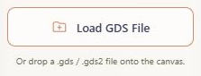</a> |  |

An empty drawing area is normal. The file button is ready on the left; root-cell
and depth controls become available after a file loads. Nothing opens automatically.

If your browser will not open the page directly, try the
[optional local server](../README.md#if-opening-the-html-directly-does-not-work).
These screenshots use that server in the Codex in-app browser on Windows.
The [validation record](yzuda-demo-validation.md) separates the current checks from
earlier direct-file tests and untested platforms.

### Day and night mode

Use the pill at the top right to change the appearance. Its label names the mode
you will switch **to**: **Night** in day mode, and **Day** in night mode.

| Day mode | Night mode |
| --- | --- |
| <a href="images/day/01-open-viewer.jpg">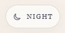</a> |  |

The first visit follows your system appearance. A manual choice is remembered
when browser storage is available. Switching modes keeps your zoom, pan, root,
hidden cells and layers, grid choice, and saved rulers.

## 2. Load the example layout

1. Click **Load GDS File**.
2. Open the project's `examples/yzuda` folder in the picker.
3. Choose **xor.gds2**.
4. Click **Fit View**.

| Day mode | Night mode |
| --- | --- |
|  |  |

The workspace heading now says **xor.gds2**. The status at the bottom right shows
**4 / 4 cells**, **15 / 15 layers**, and **520 visible polygons**. This is our
starting point for the walkthrough. The source file calls its top cell `abc2`,
even though the filename is `xor.gds2`.

The left sidebar holds visibility and hierarchy controls; the canvas toolbar is
above the drawing. The scale bar sits at the drawing's lower left. The sidebar
scrolls on its own—scroll there if you cannot see all the layers or the measurement list.

To open your own design, choose a supported `.gds` or `.gds2` file instead, or drag
it into the drawing area. Loading another file replaces the view and clears its
measurements. Files stay in your browser.

## 3. Move, zoom, and fit

Point at an interesting part of the layout and scroll to zoom in. Drag to move the
view. When you want the whole design back, click **Fit View**.

| Day mode | Night mode |
| --- | --- |
| <a href="images/day/03-zoom-and-pan.jpg">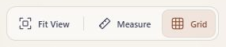</a> | <a href="images/night/03-zoom-and-pan.jpg">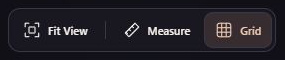</a> |

| Day mode | Night mode |
| --- | --- |
| <a href="images/day/03-zoom-and-pan.jpg">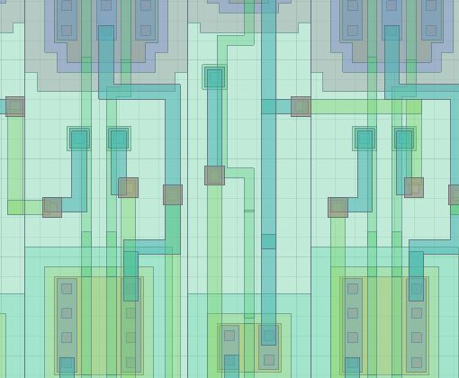</a> | <a href="images/night/03-zoom-and-pan.jpg">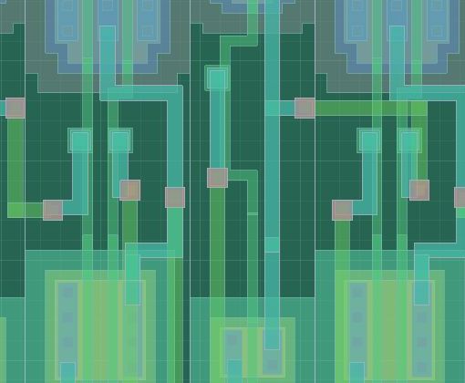</a> |

The shapes get larger, while their borders stay thin. Geometry outside the window
is still there. **Fit View** brings it back into view, but does not restore hidden
layers or cells; use **Show All** for those.

You can also hold **z** to zoom in and **x** to zoom out at the pointer. Shortcuts
do not interrupt typing in an input or selecting a root cell.

## 4. Show or hide layers and cells

### Hide one layer

A layer button includes both the layer number and its datatype. **L47/D0**, for
example, means layer 47, datatype 0.

Click **Show All**, then **Fit View**. Scroll down in the sidebar and click
**L47/D0**, the light-blue layer.

| Day mode | Night mode |
| --- | --- |
| <a href="images/day/04-layer-visibility.jpg">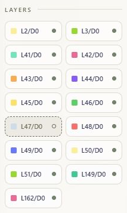</a> | <a href="images/night/04-layer-visibility.jpg">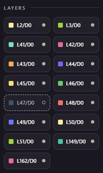</a> |

| Day mode | Night mode |
| --- | --- |
| <a href="images/day/04-layer-visibility.jpg">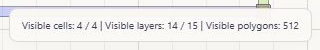</a> | <a href="images/night/04-layer-visibility.jpg">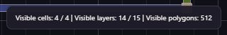</a> |

The button becomes muted, with a dashed border and hollow indicator, and its shapes
disappear. There are now **14 / 15 visible layers**
and **512 visible polygons**. Click the button again to restore the layer.

### Hide a cell branch

A **cell** is a named group of shapes that can include other cells. Click
**Show All** again, then click the **nand2** name under **Cells**.

| Day mode | Night mode |
| --- | --- |
| <a href="images/day/05-cell-visibility.jpg">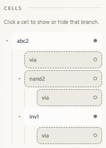</a> | <a href="images/night/05-cell-visibility.jpg">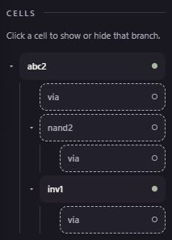</a> |

Some of the remaining wiring looks like this:

| Day mode | Night mode |
| --- | --- |
| <a href="images/day/05-cell-visibility.jpg">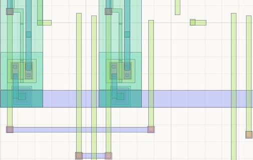</a> | <a href="images/night/05-cell-visibility.jpg">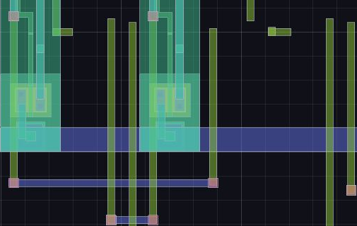</a> |

The repeated `nand2` geometry disappears along with its `via` child. Visibility is
shared by cell name, so `via` is hidden in its other placements too. You will see
both names marked hidden in the tree. The result is **2 / 4 visible cells** and
**166 visible polygons**.

Click a cell's **name** to change visibility. The small triangle beside it expands
or collapses the tree listing. **Show All** restores hidden geometry; these controls
never delete anything from the file. Click **Show All** before continuing.

## 5. Inspect one cell

To see what one `nand2` cell contains, choose it as the root:

1. Expand **Root cell & hierarchy**.
2. Select **nand2** in **Root cell**.
3. Leave **Hierarchy depth** empty.
4. Click **Apply view options**.

| Day mode | Night mode |
| --- | --- |
| <a href="images/day/06-root-cell.jpg">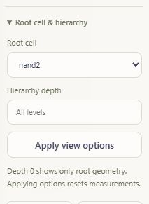</a> | <a href="images/night/06-root-cell.jpg">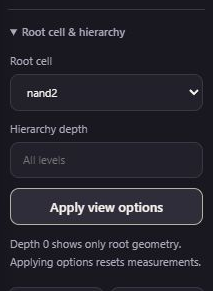</a> |

You now see a single `nand2` layout and its nested `via` geometry, rather than all
of its placements in the XOR design. The status shows **107 visible polygons**.
The grey **All levels** text is a hint: the depth field is empty.

Choose **All top-level cells** and apply to return to the full design. Applying
view options resets visibility choices and clears saved measurements.

## 6. Limit the hierarchy depth

Cells inside cells form the **hierarchy**. To see just the top cell's own geometry,
select **abc2**, enter **0** in **Hierarchy depth**, and apply.

| Day mode | Night mode |
| --- | --- |
| <a href="images/day/07-hierarchy-depth.jpg">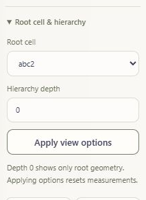</a> | <a href="images/night/07-hierarchy-depth.jpg">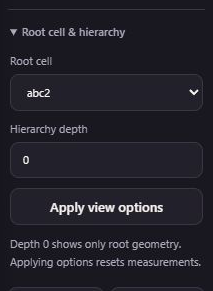</a> |

Only the shapes belonging directly to `abc2` remain: **28 polygons on 4 layers**.
The nested gate and via cells are left out of this view.

| Depth | What you see |
| --- | --- |
| Empty | Every nested level. |
| `0` | The selected root's own shapes. |
| `1` | The root and its immediate children. |
| `2` | The root, its children, and their children. |

Use a non-negative whole number. To return to the overview, choose **All top-level
cells**, erase the depth value, and apply. Depth can reduce the amount drawn after
loading; it cannot prevent every slow or oversized file load.

## 7. Use the grid and scale bar

The grid starts on, with stronger major lines and five lighter subdivisions per
interval. If you have hidden it, click **Grid** to restore both levels.

| Day mode | Night mode |
| --- | --- |
| <a href="images/day/08-grid-and-scale.jpg">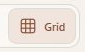</a> | <a href="images/night/08-grid-and-scale.jpg">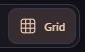</a> |

| Day mode | Night mode |
| --- | --- |
| <a href="images/day/08-grid-and-scale.jpg">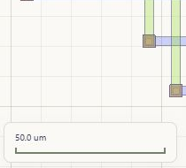</a> | <a href="images/night/08-grid-and-scale.jpg">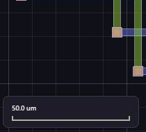</a> |

Grid lines appear behind the layout and adapt their spacing as you zoom. The scale
bar here reads **50.0 um**; it changes as you zoom. Click **Grid** to hide both
levels if you prefer. The toggle keeps your choice when another file is loaded;
a page refresh starts with the grid enabled again. The following pictures keep it on.

`um` means micrometres (µm), and `nm` means nanometres. There are 1,000 nm in 1 µm.
Read these units instead of comparing the sizes of shapes across screenshots.
The XOR file uses micrometres for its user units. The viewer currently assumes
this when labelling distances; see the [unit limitation](../README.md#supported-layouts-and-limits)
before measuring a file that uses different units.

## 8. Measure a distance

Let's place a horizontal ruler across the middle of the layout.

1. Click **Measure**, or press **m**.
2. Click a first point near the right end of the ruler shown below.
3. Hold **Ctrl** and click a second point to its left. Ctrl locks the ruler to
   the horizontal or vertical direction, whichever is closer to your movement.

| Day mode | Night mode |
| --- | --- |
| <a href="images/day/09-measure-distance.jpg">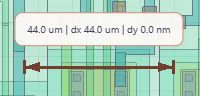</a> | <a href="images/night/09-measure-distance.jpg">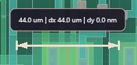</a> |

Our ruler reads **44.0 um**, with **dx 44.0 um** and **dy 0.0 nm**. `dx` is the
horizontal distance; `dy` is the vertical distance. Yours may differ slightly
because it depends on where you click. This is a walkthrough measurement, not a
reference dimension for the circuit.

After the second click, measurement mode ends and normal dragging resumes. Scroll
to **Measurements** near the bottom of the sidebar to find the saved ruler:

| Day mode | Night mode |
| --- | --- |
| <a href="images/day/09-measure-distance.jpg">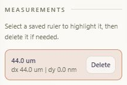</a> | <a href="images/night/09-measure-distance.jpg">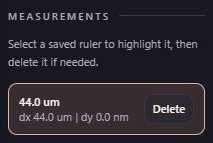</a> |

Click **Measure** again to start another ruler. While placing one, you can pan
with a right-button drag.

## 9. Read coordinates and cancel an unfinished ruler

Click **Measure** again, then click a first point near the middle of the layout.
Leave the second point unset for now.

| Day mode | Night mode |
| --- | --- |
| <a href="images/day/10-pointer-coordinates.jpg">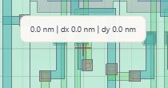</a> | <a href="images/night/10-pointer-coordinates.jpg">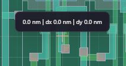</a> |

The bottom-left readout shows the current layout coordinates:

| Day mode | Night mode |
| --- | --- |
| <a href="images/day/10-pointer-coordinates.jpg">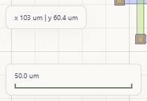</a> | <a href="images/night/10-pointer-coordinates.jpg">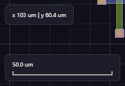</a> |

Here the readout is **x 103 um | y 60.4 um**. Your values will follow your pointer.
The new ruler starts at zero length until you move to another point, and the
previously saved ruler stays in place.

Press **m** to cancel the unfinished ruler. Its preview and coordinate readout
disappear when measurement mode ends.

## 10. Delete a measurement

Scroll to **Measurements** and click **Delete** beside the saved ruler. You can
also select its entry and press **Delete** on the keyboard.

| Day mode | Night mode |
| --- | --- |
|  |  |

After deleting it, the list looks like this:

| Day mode | Night mode |
| --- | --- |
| <a href="images/day/11-delete-measurement.jpg">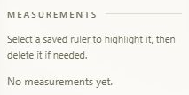</a> | <a href="images/night/11-delete-measurement.jpg">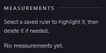</a> |

The ruler disappears from both the drawing and the list. The XOR geometry remains.

## If your screen looks different

- **Nothing has loaded yet:** choose `examples/yzuda/xor.gds2` with the file picker.
- **Parts are missing:** click **Show All**, then **Fit View**.
- **You see one cell or only wiring:** choose **All top-level cells**, clear the
  depth field, and apply. The full XOR overview has 520 visible polygons.
- **A control is out of sight:** scroll inside the sidebar.
- **A file gives an error:** read the message. A failed parse leaves the previous
  layout available; the viewer does not support every GDSII element type.

See [troubleshooting](../README.md#troubleshooting) and
[supported layouts and limits](../README.md#supported-layouts-and-limits) for more.

These are real browser captures of the public YZUDA example, with 1-pixel polygon
borders. Text elements in the file are not rendered. [Source attribution](../examples/yzuda/README.md)
and [screenshot details](images/README.md) are included with the project.
